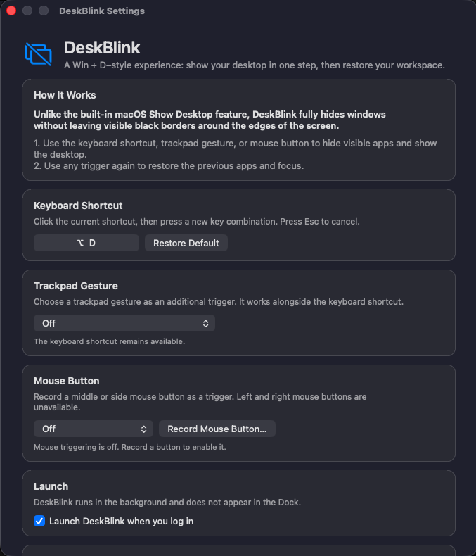
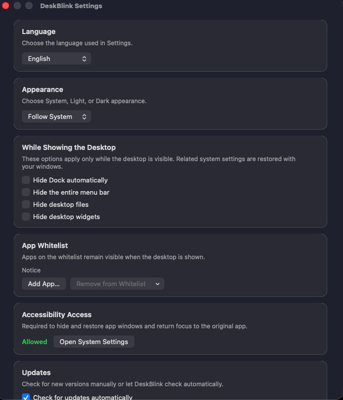

# DeskBlink

**A fast, reversible “show desktop” utility for macOS.**

DeskBlink hides your visible apps with one shortcut so you can reach a clean desktop instantly. Use the shortcut again and DeskBlink restores your apps and returns focus to the window you were using. It is designed for people who want Windows-style `Win + D` behavior on a Mac without leaving window edges around the screen.

> **Status:** Pre-release. The official macOS download and 7-day free trial are coming soon.

## Product preview

  
  

## The difference: no distracting borders around your desktop

The built-in macOS **Show Desktop** action pushes windows toward the edges of the screen. This can leave visible window strips or dark borders around all four sides, so the desktop never feels completely clear.

**DeskBlink fully hides the selected apps instead.** Your wallpaper, desktop files, and widgets can fill the whole screen without the distracting black border effect. Trigger DeskBlink again and it restores the previous apps and keyboard focus.

## What DeskBlink does

- Shows a clean desktop with one configurable keyboard shortcut.
- Restores hidden apps and the previously focused window with the same shortcut.
- Supports multiple displays.
- Offers optional trackpad gestures and recorded mouse-button triggers.
- Can optionally hide the Dock, menu bar, desktop files, and desktop widgets while the desktop is shown.
- Includes an app allowlist for apps that should remain visible.
- Runs quietly without requiring a Dock icon.

## Download and availability

**Download link coming soon with the official release.**

DeskBlink will be distributed as a macOS download through [GitHub Releases](https://github.com/joylightny/Desklink/releases). Source code is not included in this distribution repository.

### Planned system requirements

- macOS 13 Ventura or later
- Accessibility permission for reliable window hiding and restoration
- Input Monitoring permission only when global trackpad or mouse triggers are enabled

DeskBlink is currently planned as a directly distributed, unsigned and unnotarized app. macOS may require the user to approve the first launch in **System Settings → Privacy & Security**. DeskBlink will never ask users to disable Gatekeeper.

## Free trial and pricing

| License | Price | Includes |
| --- | ---: | --- |
| 7-day free trial | Free | Full access for 7 days; no payment details required |
| Launch offer | **US$2.99** | Lifetime license purchased within the first 30 days after launch |
| Standard lifetime license | **US$4.99** | One-time purchase after the launch promotion |

- No subscription.
- One lifetime license may be activated on up to **2 Macs** owned or controlled by the purchaser.
- Trial time and local activation state are stored in the macOS Keychain.
- Purchases and license delivery will be handled by Lemon Squeezy.
- Applicable taxes may be calculated at checkout depending on the buyer’s location and final store configuration.

The promotional end date will be published with the official release. Customers who purchase during the launch offer receive the same permanent license and features as customers who purchase at the standard price.

## Refund policy

DeskBlink includes a **14-day money-back guarantee** for first-time purchases if the app does not work on the customer’s Mac or does not perform as described.

To request a refund, email [joylightny@gmail.com](mailto:joylightny@gmail.com) within 14 calendar days of purchase and include the email address used at checkout and the reason for the request. Approved refunds are returned through the original payment method. Refunded licenses may be disabled after the refund is processed.

Please read the complete [Refund Policy](REFUND_POLICY.md).

## Privacy

DeskBlink is designed to work locally. The app does not sell personal data, display advertising, or track browsing activity. License activation and validation will send the license key and a randomly generated installation identifier to Lemon Squeezy. DeskBlink does not use a Mac hardware serial number as its device identifier.

Please read the complete [Privacy Policy](PRIVACY.md).

## Support

- Email: [joylightny@gmail.com](mailto:joylightny@gmail.com)
- Public questions and bug reports: [GitHub Issues](https://github.com/joylightny/Desklink/issues)
- Support information: [SUPPORT.md](SUPPORT.md)

When requesting technical support, please include the macOS version, Mac model, DeskBlink version, and a short description of what happened. Do not post a complete license key in a public issue.

## Legal and acceptable use

DeskBlink is an original macOS productivity utility. It is not a cracking, circumvention, surveillance, cheating, financial, gambling, adult, or unauthorized-content product. Users must not redistribute or resell DeskBlink license keys.

The planned commercial license terms are available in the [End User License Agreement](EULA.md).

---

## 中文简介

DeskBlink 是一款 macOS 显示桌面工具。按一次快捷键隐藏当前可见的应用并显示干净桌面，再按一次恢复刚才的应用和窗口焦点。

- 免费完整试用 7 天，无需预先填写付款信息。
- 上线前 30 天早鸟买断价为 **US$2.99**。
- 之后的永久买断价为 **US$4.99**。
- 无订阅；一个授权最多激活 2 台本人使用的 Mac。
- 正式下载链接将在发布时加入 GitHub Releases。
- 支持邮箱：[joylightny@gmail.com](mailto:joylightny@gmail.com)

购买、授权发放及相关税费将通过 Lemon Squeezy 处理。
